<div align="center">
  
</div>

<h1 align="center">我有一只月亮 · A Moon of My Own</h1>

<p align="center">
  沿途拾月，满笺清辉。<br/>
  <i>Gather moonlight along the way, keep a page full of its glow.</i>
</p>

<p align="center">
  <a href="#中文">中文</a> · <a href="#english">English</a>
</p>

---

## 中文

时间长河中的月亮——一个单文件、沉浸式的诗乐网站。从《诗经》的「月出皎兮」到此刻的流行歌，中文诗歌、中文歌曲与世界诗乐沐在同一片月光里，顺流而下。

### 四种模式

| 模式 | 内容 |
| --- | --- |
| **时间长河** | 诗歌、歌曲、世界诗乐三者按系年合并，从先秦一路漂到今天 |
| **中文诗歌** | 60 首，可按专题漫游：李白／苏轼／中秋／边关的月亮 |
| **中文歌曲** | 按年份顺流而下的月光之歌，附演唱与词曲署名 |
| **世界诗乐** | 外文诗歌与歌曲混排，译文附译者 |

### 特色

- **真实 3D 月相**：Three.js 渲染，NASA SVS 月面纹理；点击任意条目，月相随之变换；着陆页以指针拂过月面，可见当日农历月相
- **拾月集**：心动的句子收进笺中——收录／删除／拖拽排序，可导出 TXT，亦可设计笺纸 JPG（底色 × 纹样 × 月相）
- **月之声**：AI 生成的月夜环境音（流光／风铃／深空），默认静音，想听再开
- **拨轮时间轴**：底部科幻刻度带，朝代／年份标注与跟随读数；诗歌小专题时间跨度小，时间轴自动隐去
- **数据不出浏览器**：拾月集保存在 localStorage，无任何服务器与账号

### 本地运行

单文件应用，无需构建。但月面纹理与音频通过 `fetch` 加载，受浏览器 CORS 限制，请用任意静态服务器打开：

```bash
cd a-moon-of-my-own     # 进入项目根目录
python3 -m http.server 8000
# 打开 http://localhost:8000
```

直接双击 `index.html`（file:// 协议）会导致纹理与音频加载失败。

### 技术

- [Three.js](https://threejs.org/) r160（importmap，CDN 加载）
- 无框架、无构建步骤——全部在一个 `index.html`
- 月面纹理：NASA Scientific Visualization Studio
- 字体：Noto Serif SC / EB Garamond（Google Fonts）

### 内容与版权

- 古典诗词原文属公有领域
- 现代歌曲的演唱、词曲作者为事实性署名；歌词片段版权归原权利人所有，本站仅作非商业摘录欣赏
- 世界诗歌译文均附译者署名；查无可靠译者信息的宁可留空
- 背景环境音为 AI 生成
- 月面纹理来自 NASA SVS，依 NASA 媒体使用准则使用

### License

本站**代码**以 [MIT](./LICENSE) 发布；上述内容性素材的权利状态见「内容与版权」一节，不随代码授权。

---

## English

**A Moon of My Own** — a single-file, immersive website of moonlight across the river of time. From the *Book of Songs* ("月出皎兮") to today's pop songs, Chinese poetry, Chinese songs, and world poetry & music drift downstream beneath the same moon.

### Four modes

| Mode | Contents |
| --- | --- |
| **River of Time** | Poems, songs, and world poetry merged into one chronological stream, from pre-Qin to today |
| **Chinese Poetry** | 60 poems, browsable by theme: Li Bai / Su Shi / Mid-Autumn / Frontier moon |
| **Chinese Songs** | Moon songs flowing by year, with singer & songwriter credits |
| **World Poetry & Music** | Foreign poems and songs interleaved, translations credited |

### Highlights

- **Real 3D moon phases**: rendered with Three.js using NASA SVS lunar textures; clicking any entry shifts the phase; on the landing page, brush the moon with your cursor to see tonight's lunar phase
- **Moon Gatherings (拾月集)**: a commonplace book for lines you love — collect, delete, drag to reorder, export as TXT, or design a stationery JPG (paper color × pattern × moon phase)
- **Sounds of the Moon**: AI-generated night ambiences (stream of light / wind chimes / deep space), muted by default
- **Dial timeline**: a sci-fi scrubber with dynasty/year ticks and a trailing readout; hidden automatically in small-theme poetry views
- **Privacy**: everything stays in your browser via localStorage — no server, no account

### Run locally

No build step. Textures and audio are fetched, so browsers block them over `file://` — serve the folder instead:

```bash
cd a-moon-of-my-own     # the project root
python3 -m http.server 8000
# visit http://localhost:8000
```

### Tech

- [Three.js](https://threejs.org/) r160 via importmap (CDN)
- No framework, no bundler — everything lives in one `index.html`
- Lunar textures: NASA Scientific Visualization Studio
- Fonts: Noto Serif SC / EB Garamond (Google Fonts)

### Content & rights

- Classical Chinese poems are in the public domain
- Song titles, singers, and songwriter credits are factual attribution; quoted lyric fragments remain the property of their rights holders and are excerpted here for non-commercial appreciation
- Translators of world poetry are credited wherever reliably known
- Ambient audio is AI-generated
- Lunar textures are courtesy of NASA SVS, used per NASA media guidelines

### License

The **code** is released under [MIT](./LICENSE). The content materials listed above keep their own rights status and are not covered by the code license.
